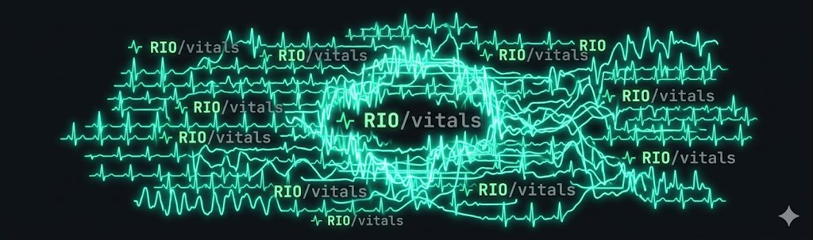

# Hi, I'm Roland 👋

**Houston, TX · Public Health + Nursing Track · Builder**

I build human-centered tools — most seriously in healthcare. I spent ~300 hours in a behavioral health and transitional care clinic and started building software to help close the gaps I saw there.

---

## 🩺 Flagship — IO

**[IO — Caregiver Coordination](https://github.com/rolandriofrio7-dev/care-command-center)**
A non-diagnostic caregiver coordination prototype built from real clinical experience. Tracks whether care-plan tasks happened on time, surfaces drift, and keeps a human in charge of every judgment.
Python/FastAPI · Next.js/React/TypeScript · 546 automated tests · synthetic-only, non-diagnostic by design.

## 🛠️ Skills

**Languages**

-FF61F6)

**AI tools**

**Frameworks & tools**

**Creative & productivity**

---

## 🧩 What I build

`Care-coordination software (IO)` · `After Effects panels (Rio Suite)` · `Ad & revenue dashboards (Signal)` · `Conversion-focused websites` · `Paid media & funnels` · `Brand films & content` · `Streetwear brand (STRANDED)`

---

## 🎓 Education

**The University of Texas at San Antonio**
B.S. Public Health · San Antonio, TX · 2026

---

Full portfolio → <a href="https://rolandrio.org">rolandrio.org</a> · Building from clinical experience · Learning in steps

